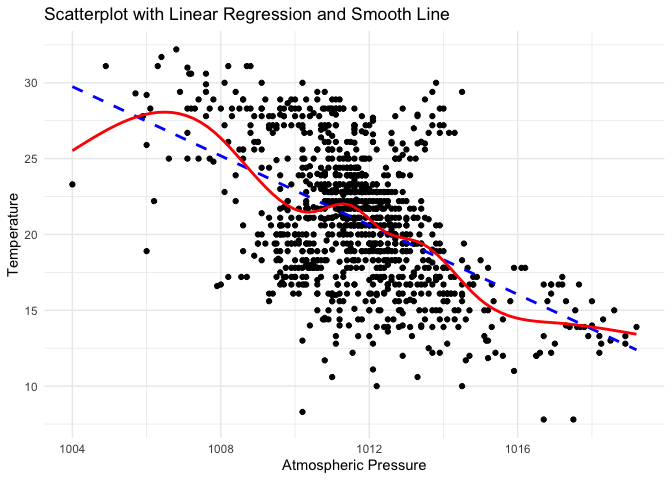
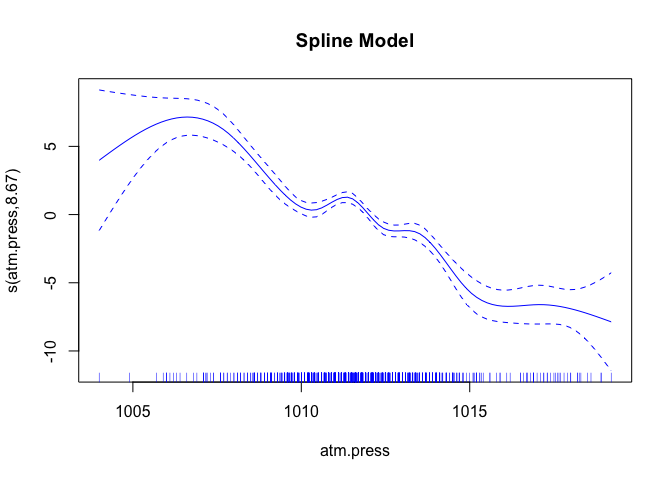

Lab 05 - Data Wrangling
================
Cathy Pei
Feb 7, 2024

# Learning goals

- Use the `merge()` function to join two datasets.
- Deal with missings and impute data.
- Identify relevant observations using `quantile()`.
- Practice your GitHub skills.

# Lab description

For this lab we will be dealing with the meteorological dataset `met`.
In this case, we will use `data.table` to answer some questions
regarding the `met` dataset, while at the same time practice your
Git+GitHub skills for this project.

This markdown document should be rendered using `github_document`
document.

# Part 1: Setup a Git project and the GitHub repository

1.  Go to wherever you are planning to store the data on your computer,
    and create a folder for this project

2.  In that folder, save [this
    template](https://github.com/JSC370/JSC370-2024/blob/main/labs/lab05/lab05-wrangling-gam.Rmd)
    as “README.Rmd”. This will be the markdown file where all the magic
    will happen.

3.  Go to your GitHub account and create a new repository of the same
    name that your local folder has, e.g., “JSC370-labs”.

4.  Initialize the Git project, add the “README.Rmd” file, and make your
    first commit.

5.  Add the repo you just created on GitHub.com to the list of remotes,
    and push your commit to origin while setting the upstream.

Most of the steps can be done using command line:

``` sh
# Step 1
cd ~/Documents
mkdir JSC370-labs
cd JSC370-labs

# Step 2
wget https://raw.githubusercontent.com/JSC370/JSC370-2024/main/labs/lab05/lab05-wrangling-gam.Rmd
mv lab05-wrangling-gam.Rmd README.Rmd
# if wget is not available,
curl https://raw.githubusercontent.com/JSC370/JSC370-2024/main/labs/lab05/lab05-wrangling-gam.Rmd --output README.Rmd

# Step 3
# Happens on github

# Step 4
git init
git add README.Rmd
git commit -m "First commit"

# Step 5
git remote add origin git@github.com:[username]/JSC370-labs
git push -u origin master
```

You can also complete the steps in R (replace with your paths/username
when needed)

``` r
# Step 1
setwd("~/Documents")
dir.create("JSC370-labs")
setwd("JSC370-labs")

# Step 2
download.file(
  "https://raw.githubusercontent.com/JSC370/JSC370-2024/main/labs/lab05/lab05-wrangling-gam.Rmd",
  destfile = "README.Rmd"
  )

# Step 3: Happens on Github

# Step 4
system("git init && git add README.Rmd")
system('git commit -m "First commit"')

# Step 5
system("git remote add origin git@github.com:[username]/JSC370-labs")
system("git push -u origin master")
```

Once you are done setting up the project, you can now start working with
the MET data.

## Setup in R

1.  Load the `data.table` (and the `dtplyr` and `dplyr` packages),
    `mgcv`, `ggplot2`, `leaflet`, `kableExtra`.

``` r
library(data.table)
library(dtplyr)
library(dplyr)
```

    ## 
    ## Attaching package: 'dplyr'

    ## The following objects are masked from 'package:data.table':
    ## 
    ##     between, first, last

    ## The following objects are masked from 'package:stats':
    ## 
    ##     filter, lag

    ## The following objects are masked from 'package:base':
    ## 
    ##     intersect, setdiff, setequal, union

``` r
library(mgcv)
```

    ## Loading required package: nlme

    ## 
    ## Attaching package: 'nlme'

    ## The following object is masked from 'package:dplyr':
    ## 
    ##     collapse

    ## This is mgcv 1.8-41. For overview type 'help("mgcv-package")'.

``` r
library(ggplot2)
library(leaflet)
library(kableExtra)
```

    ## 
    ## Attaching package: 'kableExtra'

    ## The following object is masked from 'package:dplyr':
    ## 
    ##     group_rows

2.  Load the met data from
    <https://github.com/JSC370/JSC370-2024/main/data/met_all_2023.gz> or
    (Use
    <https://raw.githubusercontent.com/JSC370/JSC370-2024/main/data/met_all_2023.gz>
    to download programmatically), and also the station data. For the
    latter, you can use the code we used during lecture to pre-process
    the stations data:

``` r
# Download the data
stations <- fread("ftp://ftp.ncdc.noaa.gov/pub/data/noaa/isd-history.csv")
stations[, USAF := as.integer(USAF)]
```

    ## Warning in eval(jsub, SDenv, parent.frame()): NAs introduced by coercion

``` r
# Dealing with NAs and 999999
stations[, USAF   := fifelse(USAF == 999999, NA_integer_, USAF)]
stations[, CTRY   := fifelse(CTRY == "", NA_character_, CTRY)]
stations[, STATE  := fifelse(STATE == "", NA_character_, STATE)]

# Selecting the three relevant columns, and keeping unique records
stations <- unique(stations[, list(USAF, CTRY, STATE, LAT, LON)])

# Dropping NAs
stations <- stations[!is.na(USAF)]

# Removing duplicates
stations[, n := 1:.N, by = .(USAF)]
stations <- stations[n == 1,][, n := NULL]

# Read in the met data and fix lat, lon, temp
fn <- "https://raw.githubusercontent.com/JSC370/JSC370-2024/main/data/met_all_2023.gz"
if (!file.exists("met_all_2023.gz"))
  download.file(fn, destfile = "met_all_2023.gz")
met <- data.table::fread("met_all_2023.gz")

met$lat <- met$lat/1000
met$lon <- met$lon/1000
met$wind.sp <- met$wind.sp/10
met$temp <- met$temp/10
met$dew.point <- met$dew.point/10
met$atm.press <- met$atm.press/10
```

3.  Merge the data as we did during the lecture. Use the `merge()` code
    and you can also try the tidy way with `left_join()`

``` r
# merge the data using left join
data <- left_join(met, stations, by = c("USAFID" = "USAF"))
# remove duplicate column for lat and lon
data <- subset(data, select = -c(LAT, LON))
```

## Question 1: Identifying Representative Stations

Across all weather stations, which stations have the median values of
temperature, wind speed, and atmospheric pressure? Using the
`quantile()` function, identify these three stations. Do they coincide?

``` r
# find median value for each station
median_by_station <- data %>%
  group_by(USAFID) %>%
  summarise(
    temp = median(temp, na.rm = TRUE),
    wind.sp = median(wind.sp,na.rm = TRUE),
    atm.press = median(atm.press,na.rm = TRUE),
    elev = median(elev,na.rm = TRUE)
  )
median_by_station
```

    ## # A tibble: 1,852 × 5
    ##    USAFID  temp wind.sp atm.press  elev
    ##     <int> <dbl>   <dbl>     <dbl> <dbl>
    ##  1 690150  26.7     4.1     1009.   696
    ##  2 720110  28       3.1       NA    336
    ##  3 720113  20       3.1       NA    222
    ##  4 720120  24       3.6       NA      6
    ##  5 720137  21.1     2.6       NA    178
    ##  6 720151  28.0     3.6       NA   1315
    ##  7 720169  23       3.6       NA    149
    ##  8 720170  23.5     2.6       NA    117
    ##  9 720172  23.4     2.1       NA    329
    ## 10 720175  25       2.6     1011.    82
    ## # … with 1,842 more rows

``` r
# identify stations with median values using quantile()
median_temp <- median(median_by_station$temp, na.rm = TRUE)

stations_with_median_temp <- median_by_station %>%
  group_by(USAFID) %>%
  filter(quantile(temp, 0.5, na.rm = TRUE) == median_temp) %>%
  distinct(USAFID)

median_wind_sp <- median(median_by_station$wind.sp, na.rm = TRUE)

stations_with_median_wind_sp <- median_by_station %>%
  group_by(USAFID) %>%
  filter(quantile(wind.sp, 0.5, na.rm = TRUE) == median_wind_sp) %>%
  distinct(USAFID)

median_atm_press <- median(median_by_station$atm.press, na.rm = TRUE)

stations_with_median_atm_press <- median_by_station %>%
  group_by(USAFID) %>%
  filter(quantile(atm.press, 0.5, na.rm = TRUE) == median_atm_press) %>%
  distinct(USAFID)
```

Next identify the stations have these median values.

``` r
# print the station IDs
print(stations_with_median_temp)
```

    ## # A tibble: 51 × 1
    ## # Groups:   USAFID [51]
    ##    USAFID
    ##     <int>
    ##  1 720137
    ##  2 720285
    ##  3 720413
    ##  4 720674
    ##  5 722172
    ##  6 722185
    ##  7 723084
    ##  8 723117
    ##  9 723118
    ## 10 723120
    ## # … with 41 more rows

``` r
print(stations_with_median_wind_sp)
```

    ## # A tibble: 577 × 1
    ## # Groups:   USAFID [577]
    ##    USAFID
    ##     <int>
    ##  1 720110
    ##  2 720113
    ##  3 720258
    ##  4 720261
    ##  5 720266
    ##  6 720267
    ##  7 720268
    ##  8 720272
    ##  9 720283
    ## 10 720284
    ## # … with 567 more rows

``` r
print(stations_with_median_atm_press)
```

    ## # A tibble: 41 × 1
    ## # Groups:   USAFID [41]
    ##    USAFID
    ##     <int>
    ##  1 722069
    ##  2 722070
    ##  3 722185
    ##  4 722197
    ##  5 722223
    ##  6 722225
    ##  7 722230
    ##  8 722280
    ##  9 722310
    ## 10 722499
    ## # … with 31 more rows

``` r
# find coincide station
coincide_stations <- Reduce(intersect, list(stations_with_median_temp$USAFID, stations_with_median_wind_sp$USAFID, stations_with_median_atm_press$USAFID))

# print the coincide station IDs
print(coincide_stations)
```

    ## [1] 722185

Knit the document, commit your changes, and save it on GitHub. Don’t
forget to add `README.md` to the tree, the first time you render it.

## Question 2: Identifying Representative Stations per State

Now let’s find the weather stations by state with closest temperature
and wind speed based on the euclidean distance from these medians.

``` r
median_by_station_with_state <- left_join(median_by_station, stations, by = c("USAFID" = "USAF"))

# calculate Euclidean distance
median_by_station_with_state$distance <- sqrt((median_by_station_with_state$temp - median_temp)^2 + 
                              (median_by_station_with_state$wind.sp - median_wind_sp)^2)

# find the station with the smallest distance for each state
closest_stations <- median_by_station_with_state %>%
  group_by(STATE) %>%
  slice(which.min(distance)) %>%
  select(STATE, USAFID, temp, wind.sp, distance, LAT, LON)

# print the result
print(closest_stations)
```

    ## # A tibble: 48 × 7
    ## # Groups:   STATE [48]
    ##    STATE USAFID  temp wind.sp distance   LAT    LON
    ##    <chr>  <int> <dbl>   <dbl>    <dbl> <dbl>  <dbl>
    ##  1 AL    720413  21.1     2.6    0.5    34.3  -87.6
    ##  2 AR    723445  22.2     2.6    1.21   36.0  -94.2
    ##  3 AZ    723723  20.6     3.6    0.707  34.6 -112. 
    ##  4 CA    724800  20.6     3.1    0.5    37.4 -118. 
    ##  5 CO    720531  20.8     3.1    0.300  38.8 -108. 
    ##  6 CT    725045  20.6     3.1    0.5    41.3  -72.9
    ##  7 DE    724093  21.1     3.6    0.5    38.7  -75.4
    ##  8 FL    722067  23       3.1    1.90   30.2  -81.9
    ##  9 GA    722185  21.1     3.1    0      34.3  -83.8
    ## 10 IA    725465  21.1     3.1    0      41.1  -92.4
    ## # … with 38 more rows

Knit the doc and save it on GitHub.

## Question 3: In the Geographic Center?

For each state, identify which station is closest to the geographic
mid-point (median) of the state. Combining these with the stations you
identified in the previous question, use `leaflet()` to visualize all
\~100 points in the same figure, applying different colors for the
geographic median and the temperature and wind speed median.

``` r
# calculate geographic mid-point for each state
state_midpoints <- median_by_station_with_state %>%
  group_by(STATE) %>%
  summarise(MedianLat = median(LAT),
            MedianLon = median(LON))

# find the closest station to the geographic mid-point for each state
closest_midpoint_stations <- median_by_station_with_state %>%
  left_join(state_midpoints, by = "STATE") %>%
  mutate(distance_to_midpoint = sqrt((LAT - MedianLat)^2 + (LON - MedianLon)^2)) %>%
  group_by(STATE) %>%
  slice(which.min(distance_to_midpoint)) %>%
  select(STATE, USAFID, MedianLat, MedianLon, temp, wind.sp, LAT, LON)

# leaflet visualization
map<-leaflet() %>%
  addTiles() %>%
  addAwesomeMarkers(
    data = closest_midpoint_stations,
    ~LON, ~LAT, 
    icon = awesomeIcons(icon = "star", markerColor = "blue", library = "fa"),
    popup = ~paste("State: ", STATE, "<br>",
                   "USAFID: ", USAFID, "<br>",
                   "Temperature: ", temp, "<br>",
                   "Wind Speed: ", wind.sp),
    group = "Geographic Median"
  ) %>%
  addAwesomeMarkers(
    data = closest_stations,
    ~LON, ~LAT, 
    icon = awesomeIcons(icon = "circle", markerColor = "green", library = "fa"),
    popup = ~paste("State: ", STATE, "<br>",
                   "USAFID: ", USAFID, "<br>",
                   "Temperature: ", temp, "<br>",
                   "Wind Speed: ", wind.sp),
    group = "Temperature/Wind Speed Median"
  ) %>%
   addLayersControl(
    overlayGroups = c("Geographic Median", "Temperature/Wind Speed Median"),
    options = layersControlOptions(collapsed = FALSE)
  )
map
```

<div class="leaflet html-widget html-fill-item-overflow-hidden html-fill-item" id="htmlwidget-2f88a95fa11f2e21be1e" style="width:672px;height:480px;"></div>
<script type="application/json" data-for="htmlwidget-2f88a95fa11f2e21be1e">{"x":{"options":{"crs":{"crsClass":"L.CRS.EPSG3857","code":null,"proj4def":null,"projectedBounds":null,"options":{}}},"calls":[{"method":"addTiles","args":["https://{s}.tile.openstreetmap.org/{z}/{x}/{y}.png",null,null,{"minZoom":0,"maxZoom":18,"tileSize":256,"subdomains":"abc","errorTileUrl":"","tms":false,"noWrap":false,"zoomOffset":0,"zoomReverse":false,"opacity":1,"zIndex":1,"detectRetina":false,"attribution":"&copy; <a href=\"https://openstreetmap.org/copyright/\">OpenStreetMap<\/a>,  <a href=\"https://opendatacommons.org/licenses/odbl/\">ODbL<\/a>"}]},{"method":"addAwesomeMarkers","args":[[32.383,35.6,33.466,36.311,39.05,41.51,39.133,28.821,32.633,41.691,44.171,39.831,40.711,38.068,37.578,30.558,42.212,39.173,44.533,43.322,45.544,38.947,32.32,47.517,35.582,48.39,40.961,43.205,40.277,35.003,39.601,41.701,40.28,35.417,44.905,40.218,41.597,33.967,44.382,36.009,31.133,40.219,37.4,44.533,47.445,44.359,39,43.062],[-86.35,-92.45,-111.721,-119.623,-105.516,-72.828,-75.467,-81.81,-83.6,-93.566,-114.927,-88.872,-86.375,-97.275,-84.77,-92.099,-71.114,-76.684,-69.667,-84.688,-94.052,-92.683,-90.078,-111.183,-79.101,-100.024,-98.313,-71.503,-74.816,-105.663,-116.006,-74.795,-83.115,-97.383,-123.001,-76.855,-71.412,-80.8,-100.286,-86.52,-97.717,-111.723,-77.517,-72.615,-122.314,-89.837,-80.274,-108.447],{"icon":"star","markerColor":"blue","iconColor":"white","spin":false,"squareMarker":false,"iconRotate":0,"font":"monospace","prefix":"fa"},null,"Geographic Median",{"interactive":true,"draggable":false,"keyboard":true,"title":"","alt":"","zIndexOffset":0,"opacity":1,"riseOnHover":false,"riseOffset":250},["State:  AL <br> USAFID:  722265 <br> Temperature:  24 <br> Wind Speed:  2.6","State:  AR <br> USAFID:  720401 <br> Temperature:  23 <br> Wind Speed:  2.6","State:  AZ <br> USAFID:  722783 <br> Temperature:  30.6 <br> Wind Speed:  2.6","State:  CA <br> USAFID:  723898 <br> Temperature:  23.3 <br> Wind Speed:  3.6","State:  CO <br> USAFID:  726396 <br> Temperature:  8 <br> Wind Speed:  3.1","State:  CT <br> USAFID:  725027 <br> Temperature:  20 <br> Wind Speed:  3.1","State:  DE <br> USAFID:  724088 <br> Temperature:  21 <br> Wind Speed:  4.1","State:  FL <br> USAFID:  722213 <br> Temperature:  25 <br> Wind Speed:  3.1","State:  GA <br> USAFID:  722175 <br> Temperature:  22.8 <br> Wind Speed:  2.85","State:  IA <br> USAFID:  725466 <br> Temperature:  22 <br> Wind Speed:  3.1","State:  ID <br> USAFID:  726824 <br> Temperature:  10 <br> Wind Speed:  2.1","State:  IL <br> USAFID:  725316 <br> Temperature:  22.8 <br> Wind Speed:  4.1","State:  IN <br> USAFID:  720961 <br> Temperature:  20 <br> Wind Speed:  3.1","State:  KS <br> USAFID:  724509 <br> Temperature:  22.8 <br> Wind Speed:  3.6","State:  KY <br> USAFID:  720448 <br> Temperature:  20 <br> Wind Speed:  3.6","State:  LA <br> USAFID:  720468 <br> Temperature:  27.2 <br> Wind Speed:  2.6","State:  MA <br> USAFID:  744907 <br> Temperature:  NA <br> Wind Speed:  NA","State:  MD <br> USAFID:  724060 <br> Temperature:  22.2 <br> Wind Speed:  3.1","State:  ME <br> USAFID:  726073 <br> Temperature:  15.6 <br> Wind Speed:  2.6","State:  MI <br> USAFID:  725405 <br> Temperature:  19.5 <br> Wind Speed:  3.1","State:  MN <br> USAFID:  726550 <br> Temperature:  21.1 <br> Wind Speed:  3.1","State:  MO <br> USAFID:  720869 <br> Temperature:  23.9 <br> Wind Speed:  2.6","State:  MS <br> USAFID:  722350 <br> Temperature:  26.1 <br> Wind Speed:  3.1","State:  MT <br> USAFID:  727755 <br> Temperature:  16 <br> Wind Speed:  3.1","State:  NC <br> USAFID:  722201 <br> Temperature:  21.4 <br> Wind Speed:  2.6","State:  ND <br> USAFID:  720867 <br> Temperature:  20 <br> Wind Speed:  3.6","State:  NE <br> USAFID:  725520 <br> Temperature:  22.2 <br> Wind Speed:  3.6","State:  NH <br> USAFID:  726050 <br> Temperature:  17.2 <br> Wind Speed:  2.6","State:  NJ <br> USAFID:  724095 <br> Temperature:  19.4 <br> Wind Speed:  3.1","State:  NM <br> USAFID:  722677 <br> Temperature:  17.2 <br> Wind Speed:  5.1","State:  NV <br> USAFID:  724770 <br> Temperature:  14.4 <br> Wind Speed:  3.1","State:  NY <br> USAFID:  725145 <br> Temperature:  15.6 <br> Wind Speed:  3.1","State:  OH <br> USAFID:  720928 <br> Temperature:  18 <br> Wind Speed:  3.1","State:  OK <br> USAFID:  723540 <br> Temperature:  24.5 <br> Wind Speed:  3.6","State:  OR <br> USAFID:  726940 <br> Temperature:  16.7 <br> Wind Speed:  3.1","State:  PA <br> USAFID:  725118 <br> Temperature:  21.1 <br> Wind Speed:  3.1","State:  RI <br> USAFID:  725074 <br> Temperature:  22 <br> Wind Speed:  6.2","State:  SC <br> USAFID:  723105 <br> Temperature:  22 <br> Wind Speed:  2.6","State:  SD <br> USAFID:  726560 <br> Temperature:  21.7 <br> Wind Speed:  4.1","State:  TN <br> USAFID:  723273 <br> Temperature:  22.8 <br> Wind Speed:  3.1","State:  TX <br> USAFID:  722570 <br> Temperature:  28.65 <br> Wind Speed:  4.1","State:  UT <br> USAFID:  725724 <br> Temperature:  19.4 <br> Wind Speed:  3.1","State:  VA <br> USAFID:  720498 <br> Temperature:  20.6 <br> Wind Speed:  2.6","State:  VT <br> USAFID:  726114 <br> Temperature:  16.1 <br> Wind Speed:  2.1","State:  WA <br> USAFID:  727930 <br> Temperature:  14.4 <br> Wind Speed:  3.1","State:  WI <br> USAFID:  726452 <br> Temperature:  19.4 <br> Wind Speed:  3.1","State:  WV <br> USAFID:  720328 <br> Temperature:  19 <br> Wind Speed:  2.6","State:  WY <br> USAFID:  726720 <br> Temperature:  13.9 <br> Wind Speed:  3.1"],null,null,null,null,{"interactive":false,"permanent":false,"direction":"auto","opacity":1,"offset":[0,0],"textsize":"10px","textOnly":false,"className":"","sticky":true},null]},{"method":"addAwesomeMarkers","args":[[34.267,36.01,34.649,37.371,38.783,41.259,38.69,30.219,34.272,41.101,46.375,39.7,39.825,37.771,38.23,32.514,41.688,38.142,44.316,42.407,45.544,40.097,34.983,48.094,36.097,48.252,42.47,42.93,40.683,36.744,39.417,42.85,41.563,35.473,45.826,40.373,41.351,34.906,43.389,35.818,35.613,41.194,37.317,44.468,46.564,44.867,38.365,44.517],[-87.6,-94.168,-112.422,-118.359,-108.067,-72.889,-75.362,-81.876,-83.83,-92.445,-117.015,-87.669,-86.296,-99.969,-85.663,-92.588,-69.993,-76.429,-69.797,-83.009,-94.052,-92.547,-89.783,-105.578,-79.943,-101.269,-98.688,-71.436,-74.169,-108.229,-118.717,-73.95,-83.477,-98.006,-119.261,-75.959,-71.806,-82.213,-99.843,-83.986,-100.996,-112.017,-79.974,-73.15,-120.535,-91.488,-82.555,-108.075],{"icon":"circle","markerColor":"green","iconColor":"white","spin":false,"squareMarker":false,"iconRotate":0,"font":"monospace","prefix":"fa"},null,"Temperature/Wind Speed Median",{"interactive":true,"draggable":false,"keyboard":true,"title":"","alt":"","zIndexOffset":0,"opacity":1,"riseOnHover":false,"riseOffset":250},["State:  AL <br> USAFID:  720413 <br> Temperature:  21.1 <br> Wind Speed:  2.6","State:  AR <br> USAFID:  723445 <br> Temperature:  22.2 <br> Wind Speed:  2.6","State:  AZ <br> USAFID:  723723 <br> Temperature:  20.6 <br> Wind Speed:  3.6","State:  CA <br> USAFID:  724800 <br> Temperature:  20.6 <br> Wind Speed:  3.1","State:  CO <br> USAFID:  720531 <br> Temperature:  20.8 <br> Wind Speed:  3.1","State:  CT <br> USAFID:  725045 <br> Temperature:  20.6 <br> Wind Speed:  3.1","State:  DE <br> USAFID:  724093 <br> Temperature:  21.1 <br> Wind Speed:  3.6","State:  FL <br> USAFID:  722067 <br> Temperature:  23 <br> Wind Speed:  3.1","State:  GA <br> USAFID:  722185 <br> Temperature:  21.1 <br> Wind Speed:  3.1","State:  IA <br> USAFID:  725465 <br> Temperature:  21.1 <br> Wind Speed:  3.1","State:  ID <br> USAFID:  727830 <br> Temperature:  21.1 <br> Wind Speed:  2.6","State:  IL <br> USAFID:  722172 <br> Temperature:  21.1 <br> Wind Speed:  3.1","State:  IN <br> USAFID:  724384 <br> Temperature:  21.1 <br> Wind Speed:  3.1","State:  KS <br> USAFID:  724510 <br> Temperature:  20.6 <br> Wind Speed:  4.1","State:  KY <br> USAFID:  724235 <br> Temperature:  21.1 <br> Wind Speed:  3.1","State:  LA <br> USAFID:  722251 <br> Temperature:  23 <br> Wind Speed:  2.6","State:  MA <br> USAFID:  725069 <br> Temperature:  19.4 <br> Wind Speed:  3.1","State:  MD <br> USAFID:  725514 <br> Temperature:  21.1 <br> Wind Speed:  3.1","State:  ME <br> USAFID:  726185 <br> Temperature:  16.1 <br> Wind Speed:  2.6","State:  MI <br> USAFID:  725375 <br> Temperature:  20.6 <br> Wind Speed:  3.1","State:  MN <br> USAFID:  726550 <br> Temperature:  21.1 <br> Wind Speed:  3.1","State:  MO <br> USAFID:  724455 <br> Temperature:  21.1 <br> Wind Speed:  3.1","State:  MS <br> USAFID:  722165 <br> Temperature:  23 <br> Wind Speed:  3.1","State:  MT <br> USAFID:  727686 <br> Temperature:  20.6 <br> Wind Speed:  3.1","State:  NC <br> USAFID:  723170 <br> Temperature:  20.6 <br> Wind Speed:  3.1","State:  ND <br> USAFID:  727676 <br> Temperature:  21.1 <br> Wind Speed:  3.6","State:  NE <br> USAFID:  725566 <br> Temperature:  21.1 <br> Wind Speed:  3.1","State:  NH <br> USAFID:  743945 <br> Temperature:  18.3 <br> Wind Speed:  2.6","State:  NJ <br> USAFID:  725020 <br> Temperature:  21.1 <br> Wind Speed:  3.6","State:  NM <br> USAFID:  723658 <br> Temperature:  21.7 <br> Wind Speed:  3.6","State:  NV <br> USAFID:  724885 <br> Temperature:  19.4 <br> Wind Speed:  3.1","State:  NY <br> USAFID:  744994 <br> Temperature:  21 <br> Wind Speed:  3.1","State:  OH <br> USAFID:  724287 <br> Temperature:  21.1 <br> Wind Speed:  3.6","State:  OK <br> USAFID:  720358 <br> Temperature:  21.3 <br> Wind Speed:  3.1","State:  OR <br> USAFID:  726883 <br> Temperature:  21.1 <br> Wind Speed:  3.1","State:  PA <br> USAFID:  725103 <br> Temperature:  21.1 <br> Wind Speed:  3.1","State:  RI <br> USAFID:  722151 <br> Temperature:  18.9 <br> Wind Speed:  3.1","State:  SC <br> USAFID:  723120 <br> Temperature:  21.1 <br> Wind Speed:  3.1","State:  SD <br> USAFID:  726518 <br> Temperature:  21.1 <br> Wind Speed:  3.6","State:  TN <br> USAFID:  723260 <br> Temperature:  21.1 <br> Wind Speed:  3.1","State:  TX <br> USAFID:  720313 <br> Temperature:  21.5 <br> Wind Speed:  4.1","State:  UT <br> USAFID:  725750 <br> Temperature:  20.6 <br> Wind Speed:  3.1","State:  VA <br> USAFID:  724110 <br> Temperature:  21.1 <br> Wind Speed:  3.1","State:  VT <br> USAFID:  726170 <br> Temperature:  18.3 <br> Wind Speed:  3.1","State:  WA <br> USAFID:  727810 <br> Temperature:  20.6 <br> Wind Speed:  3.1","State:  WI <br> USAFID:  726435 <br> Temperature:  21.1 <br> Wind Speed:  3.1","State:  WV <br> USAFID:  724250 <br> Temperature:  20.6 <br> Wind Speed:  2.6","State:  WY <br> USAFID:  726667 <br> Temperature:  17 <br> Wind Speed:  3.1"],null,null,null,null,{"interactive":false,"permanent":false,"direction":"auto","opacity":1,"offset":[0,0],"textsize":"10px","textOnly":false,"className":"","sticky":true},null]},{"method":"addLayersControl","args":[[],["Geographic Median","Temperature/Wind Speed Median"],{"collapsed":false,"autoZIndex":true,"position":"topright"}]}],"limits":{"lat":[28.821,48.39],"lng":[-123.001,-69.667]}},"evals":[],"jsHooks":[]}</script>

Knit the doc and save it on GitHub.

#### NOTE: I found that Markdown does not support the rendering of interactive content such as Leaflet maps directly within the Markdown file on GitHub. The map can be perfectly displayed when running in Rmd file but not in md file.

## Question 4: Summary Table with `kableExtra`

Generate a summary table using `kable` where the rows are each state and
the columns represent average temperature broken down by low, median,
and high elevation stations.

Use the following breakdown for elevation:

- Low: elev \< 93
- Mid: elev \>= 93 and elev \< 401
- High: elev \>= 401

``` r
library(reshape2)
```

    ## 
    ## Attaching package: 'reshape2'

    ## The following objects are masked from 'package:data.table':
    ## 
    ##     dcast, melt

``` r
# define elevation categories
median_by_station_with_cat <- median_by_station_with_state %>%
  mutate(elevation_cat = case_when(
    elev < 93 ~ "Low",
    elev >= 93 & elev < 401 ~ "Mid",
    elev >= 401 ~ "High"
  ))

# create a summary table using kable
summary_table <- median_by_station_with_cat %>%
  group_by(STATE, elevation_cat) %>%
  summarise(avg_temp = round(mean(temp, na.rm = TRUE), 2)) %>%
  acast(STATE ~ elevation_cat, value.var = "avg_temp") %>%
  kable()
```

    ## `summarise()` has grouped output by 'STATE'. You can override using the
    ## `.groups` argument.

``` r
# print the summary table
print(summary_table)
```

    ## 
    ## 
    ## |   |  High|   Low|   Mid|
    ## |:--|-----:|-----:|-----:|
    ## |AL |    NA| 24.50| 22.92|
    ## |AR | 23.45| 24.88| 23.65|
    ## |AZ | 24.82| 28.90| 31.46|
    ## |CA | 17.96| 18.08| 19.00|
    ## |CO | 14.62|    NA|    NA|
    ## |CT |    NA| 19.93| 19.10|
    ## |DE |    NA| 21.37|    NA|
    ## |FL |    NA| 26.40|    NA|
    ## |GA |    NA| 23.80| 22.45|
    ## |IA | 21.58|    NA| 21.82|
    ## |ID | 15.83|    NA|    NA|
    ## |IL | 20.20|    NA| 22.20|
    ## |IN |    NA|    NA| 19.95|
    ## |KS | 21.59|    NA| 23.50|
    ## |KY | 19.40|    NA| 21.03|
    ## |LA |    NA| 27.53| 25.82|
    ## |MA |    NA| 17.66| 17.66|
    ## |MD | 20.60| 21.27| 20.77|
    ## |ME | 15.00| 15.07| 14.94|
    ## |MI | 15.85|    NA| 18.04|
    ## |MN | 19.47| 22.55| 20.82|
    ## |MO | 23.00| 26.00| 23.14|
    ## |MS |    NA| 25.96| 24.58|
    ## |MT | 16.25|    NA|    NA|
    ## |NC | 17.82| 22.87| 20.84|
    ## |ND | 20.03|    NA| 21.51|
    ## |NE | 20.37|    NA| 23.26|
    ## |NH |  8.00| 17.60| 16.19|
    ## |NJ |    NA| 19.62| 19.70|
    ## |NM | 22.23|    NA|    NA|
    ## |NV | 21.19|    NA|    NA|
    ## |NY | 15.87| 18.94| 18.30|
    ## |OH |    NA|    NA| 19.21|
    ## |OK | 23.36|    NA| 24.68|
    ## |OR | 16.69| 15.28| 15.92|
    ## |PA | 17.22| 20.53| 19.40|
    ## |RI |    NA| 19.18| 18.00|
    ## |SC |    NA| 23.25| 21.55|
    ## |SD | 20.02|    NA| 22.10|
    ## |TN | 19.15|    NA| 22.66|
    ## |TX | 26.04| 28.19| 27.72|
    ## |UT | 19.55|    NA|    NA|
    ## |VA | 17.61| 21.47| 20.36|
    ## |VT |    NA|   NaN| 16.53|
    ## |WA | 16.47| 14.53| 17.62|
    ## |WI | 17.96|    NA| 19.37|
    ## |WV | 17.16|    NA| 19.20|
    ## |WY | 13.15|    NA|    NA|

Knit the document, commit your changes, and push them to GitHub.

## Question 5: Advanced Regression

Let’s practice running regression models with smooth functions on X. We
need the `mgcv` package and `gam()` function to do this.

- using your data with the median values per station, first create a
  lazy table. Filter out values of atmospheric pressure outside of the
  range 1000 to 1020. Examine the association between temperature (y)
  and atmospheric pressure (x). Create a scatterplot of the two
  variables using ggplot2. Add both a linear regression line and a
  smooth line.

- fit both a linear model and a spline model (use `gam()` with a cubic
  regression spline on wind speed). Summarize and plot the results from
  the models and interpret which model is the best fit and why.

``` r
# create a lazy table and filter out values of atmospheric pressure outside the range 1000 to 1020
lazy_table <- median_by_station %>%
  filter(atm.press >= 1000 & atm.press <= 1020)

# Create a scatterplot with linear regression line and smooth line
ggplot(lazy_table, aes(x = atm.press, y = temp)) +
  geom_point() +
  geom_smooth(method = "lm", se = FALSE, color = "blue", linetype = "dashed") +
  geom_smooth(method = "gam", formula = y ~ s(x, bs = "cs"), se = FALSE, color = "red") +
  labs(title = "Scatterplot with Linear Regression and Smooth Line",
       x = "Atmospheric Pressure",
       y = "Temperature") +
  theme_minimal()
```

    ## `geom_smooth()` using formula = 'y ~ x'

<!-- -->

``` r
# Fit linear model and spline model
linear_model <- lm(temp ~ atm.press, data = lazy_table)
spline_model <- gam(temp ~ s(atm.press, bs = "cs"), data = lazy_table)

# Summarize the results
summary(linear_model)
```

    ## 
    ## Call:
    ## lm(formula = temp ~ atm.press, data = lazy_table)
    ## 
    ## Residuals:
    ##      Min       1Q   Median       3Q      Max 
    ## -14.3696  -2.6173   0.1844   2.3012  11.6394 
    ## 
    ## Coefficients:
    ##               Estimate Std. Error t value Pr(>|t|)    
    ## (Intercept) 1175.93898   58.53149   20.09   <2e-16 ***
    ## atm.press     -1.14162    0.05785  -19.73   <2e-16 ***
    ## ---
    ## Signif. codes:  0 '***' 0.001 '**' 0.01 '*' 0.05 '.' 0.1 ' ' 1
    ## 
    ## Residual standard error: 3.762 on 1083 degrees of freedom
    ## Multiple R-squared:  0.2645, Adjusted R-squared:  0.2638 
    ## F-statistic: 389.4 on 1 and 1083 DF,  p-value: < 2.2e-16

``` r
summary(spline_model)
```

    ## 
    ## Family: gaussian 
    ## Link function: identity 
    ## 
    ## Formula:
    ## temp ~ s(atm.press, bs = "cs")
    ## 
    ## Parametric coefficients:
    ##             Estimate Std. Error t value Pr(>|t|)    
    ## (Intercept)  20.9378     0.1117   187.5   <2e-16 ***
    ## ---
    ## Signif. codes:  0 '***' 0.001 '**' 0.01 '*' 0.05 '.' 0.1 ' ' 1
    ## 
    ## Approximate significance of smooth terms:
    ##               edf Ref.df     F p-value    
    ## s(atm.press) 8.67      9 51.43  <2e-16 ***
    ## ---
    ## Signif. codes:  0 '***' 0.001 '**' 0.01 '*' 0.05 '.' 0.1 ' ' 1
    ## 
    ## R-sq.(adj) =  0.297   Deviance explained = 30.2%
    ## GCV = 13.647  Scale est. = 13.526    n = 1085

``` r
# Plot the results
plot(spline_model, pch = 1, col = "blue", main = "Spline Model")
```

<!-- -->

### Interpretation:

linear model: The Multiple R-squared measures the proportion of the
variance in the dependent variable (Temperature) that is explained by
the independent variable (Atmospheric Pressure) in the model. In our
case it is 0.2645, meaning approximately 26.45% of the variance in
Temperature is explained by Atmospheric Pressure. The p-value associated
with the F-statistic is extremely small (\< 2.2e-16), suggesting that
the model is statistically significant. These results suggest that there
is a statistically significant relationship between Atmospheric Pressure
and Temperature, and the model provides a reasonable fit to the data.
Spline model: The Adjusted R-squared is 0.297, indicating that
approximately 29.7% of the variance in Temperature is explained by the
spline model. Deviance explained = 30.2% implies that 30.2% of deviance
in the response variable explained by the model. The GCV is a measure of
model fit, with a lower value indicating better fit, in this case it is
13.526. These results suggest that the spline model provides a
reasonable fit to the data, explaining a substantial proportion of the
variability in Temperature.

## Deliverables

- .Rmd file (this file)

- link to the .md file (with all outputs) in your GitHub repository
