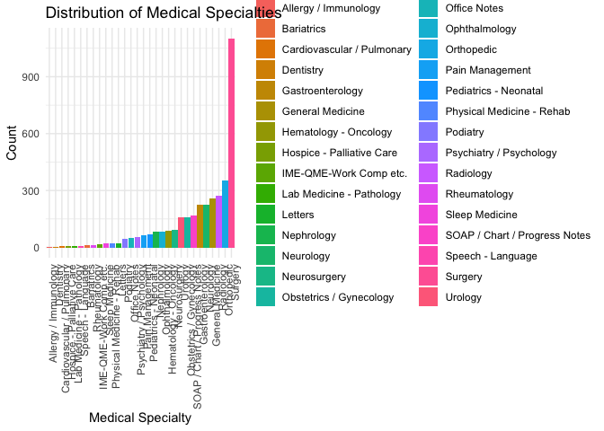
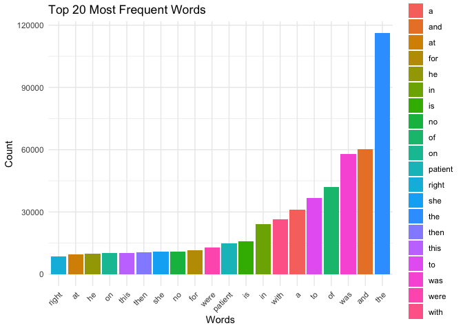
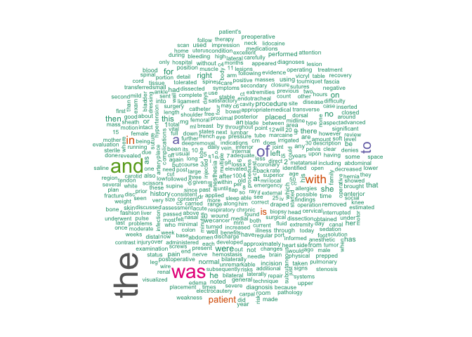
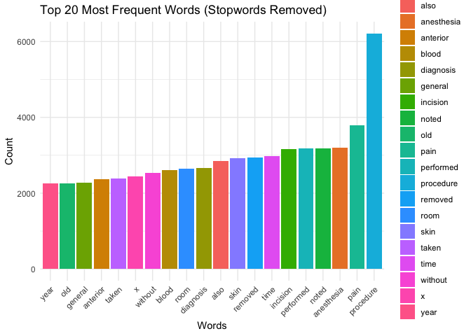
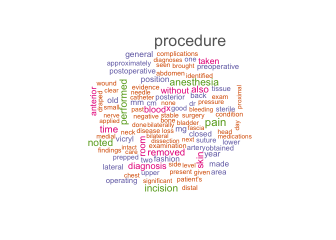
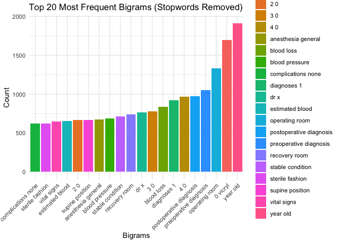
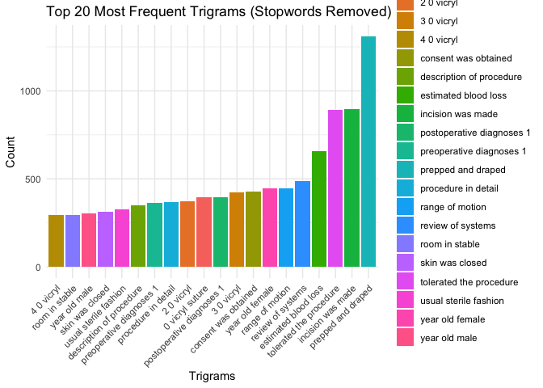
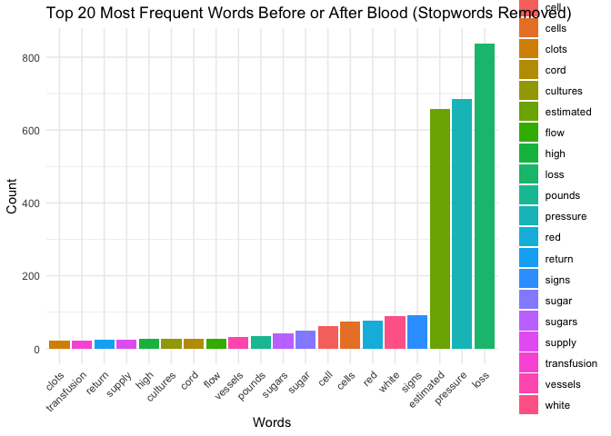
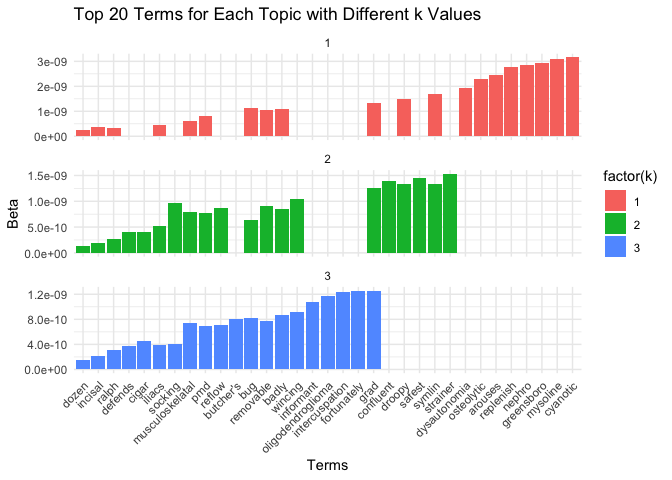

Lab 08 - Text Mining/NLP
================
Cathy Pei
Feb 28, 2024

# Learning goals

- Use `unnest_tokens()` and `unnest_ngrams()` to extract tokens and
  ngrams from text
- Use dplyr and ggplot2 to analyze and visualize text data
- Try a theme model using `topicmodels`

# Lab description

For this lab we will be working with the medical record transcriptions
from <https://www.mtsamples.com/>. And is loaded and “fairly” cleaned at
<https://github.com/JSC370/JSC370-2024/tree/main/data/medical_transcriptions>.

This markdown document should be rendered using `github_document`
document.

### Setup packages

You should load in `dplyr`, (or `data.table` if you want to work that
way), `ggplot2` and `tidytext`. Install `wordcloud`, `tm`, and
`topicmodels` if you don’t alreadyh have them.

### Read in the Medical Transcriptions

Loading in reference transcription samples from
<https://www.mtsamples.com/>

``` r
library(tidytext)
library(tidyverse)
```

    ## ── Attaching core tidyverse packages ──────────────────────── tidyverse 2.0.0 ──
    ## ✔ dplyr     1.1.4     ✔ readr     2.1.5
    ## ✔ forcats   1.0.0     ✔ stringr   1.5.1
    ## ✔ ggplot2   3.5.0     ✔ tibble    3.2.1
    ## ✔ lubridate 1.9.3     ✔ tidyr     1.3.1
    ## ✔ purrr     1.0.2     
    ## ── Conflicts ────────────────────────────────────────── tidyverse_conflicts() ──
    ## ✖ dplyr::filter() masks stats::filter()
    ## ✖ dplyr::lag()    masks stats::lag()
    ## ℹ Use the conflicted package (<http://conflicted.r-lib.org/>) to force all conflicts to become errors

``` r
library(wordcloud)
```

    ## Loading required package: RColorBrewer

``` r
library(tm)
```

    ## Loading required package: NLP
    ## 
    ## Attaching package: 'NLP'
    ## 
    ## The following object is masked from 'package:ggplot2':
    ## 
    ##     annotate

``` r
library(topicmodels)
library(ggplot2)

mt_samples <- read_csv("https://raw.githubusercontent.com/JSC370/JSC370-2024/main/data/medical_transcriptions/mtsamples.csv")
```

    ## New names:
    ## Rows: 3682 Columns: 6
    ## ── Column specification
    ## ──────────────────────────────────────────────────────── Delimiter: "," chr
    ## (5): description, medical_specialty, sample_name, transcription, keywords dbl
    ## (1): ...1
    ## ℹ Use `spec()` to retrieve the full column specification for this data. ℹ
    ## Specify the column types or set `show_col_types = FALSE` to quiet this message.
    ## • `` -> `...1`

``` r
mt_samples <- mt_samples %>%
  select(description, medical_specialty, transcription)

head(mt_samples)
```

    ## # A tibble: 6 × 3
    ##   description                                    medical_specialty transcription
    ##   <chr>                                          <chr>             <chr>        
    ## 1 A 23-year-old white female presents with comp… Allergy / Immuno… "SUBJECTIVE:…
    ## 2 Consult for laparoscopic gastric bypass.       Bariatrics        "PAST MEDICA…
    ## 3 Consult for laparoscopic gastric bypass.       Bariatrics        "HISTORY OF …
    ## 4 2-D M-Mode. Doppler.                           Cardiovascular /… "2-D M-MODE:…
    ## 5 2-D Echocardiogram                             Cardiovascular /… "1.  The lef…
    ## 6 Morbid obesity.  Laparoscopic antecolic anteg… Bariatrics        "PREOPERATIV…

------------------------------------------------------------------------

## Question 1: What specialties do we have?

We can use `count()` from `dplyr` to figure out how many different
medical specialties are in the data. Are these categories related?
overlapping? evenly distributed? Make a bar plot.

``` r
mt_samples |>
  count(medical_specialty, sort = TRUE)|> 
  ggplot(aes(x = reorder(medical_specialty, n), y = n, fill = medical_specialty)) +
  geom_bar(stat = "identity") +
  labs(title = "Distribution of Medical Specialties", x = "Medical Specialty", y = "Count") +
  theme_minimal() +
  theme(axis.text.x = element_text(angle = 90, hjust = 1))
```

<!-- -->

#### Observation

The categories are quite diverse, with no overlap (no categories share
the same medical specialty). They are not evenly distributed, as we can
see that surgery appears to have a significant number of counts compared
to other medical specialties.

------------------------------------------------------------------------

## Question 2: Tokenize

- Tokenize the the words in the `transcription` column
- Count the number of times each token appears
- Visualize the top 20 most frequent words with a bar plot
- Create a word cloud

Explain what we see from this result. Does it makes sense? What insights
(if any) do we get?

``` r
# Tokenize the the words in the `transcription` column
tokens <- mt_samples %>%
  select(transcription) %>%
  unnest_tokens(word, transcription)

# Count the number of times each token appears
token_counts <- tokens %>%
  count(word, sort = TRUE)

# Visualize the top 20 most frequent words with a bar plot
token_counts_top20 <- head(token_counts, 20)

token_counts_top20 %>%
  ggplot(aes(x = reorder(word, n), y = n, fill = word)) +
  geom_bar(stat = "identity") +
  labs(title = "Top 20 Most Frequent Words", x = "Words", y = "Count") +
  theme_minimal() +
  theme(axis.text.x = element_text(angle = 45, hjust = 1))
```

<!-- -->

``` r
# Create a word cloud
wordcloud(words = token_counts$word[1:500], freq = token_counts$n[1:500], scale = c(3, 0.5), colors = brewer.pal(8, "Dark2"))
```

<!-- -->

# Observation

The top 20 words we got, such as “the,” “and,” “was,” etc., are common
English stop words. Stop words are words that are commonly used in a
language but are typically filtered out when analyzing text data because
they don’t carry significant meaning on their own. We should remove them
to focus on more meaningful content words.

------------------------------------------------------------------------

## Question 3: Stopwords

- Redo Question 2 but remove stopwords(use stopwords package)
- Bonus points if you remove numbers as well (use regex)

What do we see know that we have removed stop words? Does it give us a
better idea of what the text is about?

- Try customizing your stopwords list to include 3-4 additional words
  that do not appear informative

``` r
head(stopwords("english"))
```

    ## [1] "i"      "me"     "my"     "myself" "we"     "our"

``` r
length(stopwords("english"))
```

    ## [1] 174

``` r
# Add custom stopwords
custom_stopwords <- c("left", "right", "normal", "well", "placed", "history", "patient", "using", "used", "will")
numeric_pattern <- paste0("\\b", 0:9, "\\b")
stop_words <- unique(c(stopwords("english"), custom_stopwords, numeric_pattern))

# Tokenize the the words in the `transcription` column with the remove of stopwords
tokens <- mt_samples %>%
  select(transcription) %>%
  unnest_tokens(word, transcription) %>%
  mutate(word = as.character(word)) %>%  # Convert 'word' to character
  filter(!(word %in% stop_words) & !grepl("\\b\\d+\\b", word))

token_counts <- tokens %>%
  count(word, sort = TRUE)

# Visualize the top 20 most frequent words with a bar plot
token_counts_top20 <- head(token_counts, 20)

# Bar plot
token_counts_top20 %>%
  ggplot(aes(x = reorder(word, n), y = n, fill = word)) +
  geom_bar(stat = "identity") +
  labs(title = "Top 20 Most Frequent Words (Stopwords Removed)", x = "Words", y = "Count") +
  theme_minimal() +
  theme(axis.text.x = element_text(angle = 45, hjust = 1))
```

<!-- -->

``` r
# Create a word cloud for the top 100 most frequent words
wordcloud(words = token_counts$word[1:100], freq = token_counts$n[1:100], scale = c(2, 0.5), colors = brewer.pal(8, "Dark2"))
```

<!-- -->

#### Observation

## By removing the stopwords, we can observe more informative words such as “blood,” “diagnosis,” and “anesthesia,” which are more closely related to the medical context.

# Question 4: ngrams

Repeat question 2, but this time tokenize into bi-grams. How does the
result change if you look at tri-grams? Note we need to remove stopwords
a little differently. You don’t need to recreate the wordclouds.

``` r
custom_stopwords <- c("left", "right", "normal", "well", "placed", "history", "patient", "using", "used", "will")
stopwords2 <- unique(c(stopwords("english"), custom_stopwords))

sw_start <- paste0("^", paste(stopwords2, collapse=" |^"), "$")
sw_end <- paste0("", paste(stopwords2, collapse="$| "), "$")


# Tokenize into bigrams and remove stopwords
tokens_bigram <- mt_samples %>%
  select(transcription) %>%
  unnest_tokens(bigram, transcription, token = "ngrams", n = 2) 
tokens_bigram <- tokens_bigram %>%
  filter(!grepl(sw_start, tokens_bigram$bigram, ignore.case = TRUE) & 
    !grepl(sw_end, tokens_bigram$bigram, ignore.case = TRUE))
  
token_counts <- tokens_bigram %>%
  count(bigram, sort = TRUE)

# Visualize the top 20 most frequent words with a bar plot
token_counts_top20 <- head(token_counts, 20)

# Bar plot
token_counts_top20 %>%
  ggplot(aes(x = reorder(bigram, n), y = n, fill = bigram)) +
  geom_bar(stat = "identity") +
  labs(title = "Top 20 Most Frequent Bigrams (Stopwords Removed)", x = "Bigrams", y = "Count") +
  theme_minimal() +
  theme(axis.text.x = element_text(angle = 45, hjust = 1))
```

<!-- -->

``` r
custom_stopwords <- c("left", "right", "normal", "well", "placed", "history", "patient", "using", "used", "will")
stopwords2 <- unique(c(stopwords("english"), custom_stopwords))

sw_start <- paste0("^", paste(stopwords2, collapse=" |^"), "$")
sw_end <- paste0("", paste(stopwords2, collapse="$| "), "$")


# Tokenize into bigrams and remove stopwords
tokens_trigram <- mt_samples %>%
  select(transcription) %>%
  unnest_tokens(trigram, transcription, token = "ngrams", n = 3) 
tokens_trigram <- tokens_trigram %>%
  filter(!grepl(sw_start, tokens_trigram$trigram, ignore.case = TRUE) & 
    !grepl(sw_end, tokens_trigram$trigram, ignore.case = TRUE))
  
token_counts <- tokens_trigram %>%
  count(trigram, sort = TRUE)

# Visualize the top 20 most frequent words with a bar plot
token_counts_top20 <- head(token_counts, 20)

# Bar plot
token_counts_top20 %>%
  ggplot(aes(x = reorder(trigram, n), y = n, fill = trigram)) +
  geom_bar(stat = "identity") +
  labs(title = "Top 20 Most Frequent Trigrams (Stopwords Removed)", x = "Trigrams", y = "Count") +
  theme_minimal() +
  theme(axis.text.x = element_text(angle = 45, hjust = 1))
```

<!-- -->

#### Observation

## We can see that, compared to bigrams, trigrams are more interpretable and relatable to the medical context, as trigrams form more professional phrases.

# Question 5: Examining words

Using the results from the bigram, pick a word and count the words that
appear before and after it, and create a plot of the top 20.

``` r
library(stringr)
# Use regex to filter bigrams containing the word "blood"
blood_bigrams <- tokens_bigram %>%
  filter(str_detect(bigram, "\\bblood\\b"))

# Tokenize the bigrams into unigrams
tokens_unigram <- blood_bigrams %>%
  unnest_tokens(word, bigram, token = "ngrams", n = 1) %>%
  filter(!(word == "blood"))  # Filter to only include words that are not "blood"

token_counts <- tokens_unigram %>%
  count(word, sort = TRUE)

# Visualize the top 20 most frequent words with a bar plot
token_counts_top20 <- head(token_counts, 20)

# Bar plot
token_counts_top20 %>%
  ggplot(aes(x = reorder(word, n), y = n, fill = word)) +
  geom_bar(stat = "identity") +
  labs(title = "Top 20 Most Frequent Words Before or After Blood (Stopwords Removed)", x = "Words", y = "Count") +
  theme_minimal() +
  theme(axis.text.x = element_text(angle = 45, hjust = 1))
```

<!-- -->

------------------------------------------------------------------------

# Question 6: Words by Specialties

Which words are most used in each of the specialties. you can use
`group_by()` and `top_n()` from `dplyr` to have the calculations be done
within each specialty. Remember to remove stopwords. How about the most
5 used words?

``` r
custom_stopwords <- c("left", "right", "normal", "well", "placed", "history", "patient", "using", "used", "will")
stopwords2 <- unique(c(stopwords("english"), custom_stopwords))

# Tokenize the words in the 'transcription' column and remove stopwords
tokens <- mt_samples %>%
  select(medical_specialty, transcription) %>%
  unnest_tokens(word, transcription) %>%
  mutate(word = as.character(word)) %>%  # Convert 'word' to character
  filter(!(word %in% stop_words) & !grepl("\\b\\d+\\b", word))

# Group by specialty and find the top 5 used words in each group
top_words_per_specialty <- tokens %>%
  group_by(medical_specialty, word) %>%
  summarize(count = n()) %>%
  group_by(medical_specialty) %>%
  top_n(5, count) %>%
  arrange(medical_specialty, desc(count))
```

    ## `summarise()` has grouped output by 'medical_specialty'. You can override using
    ## the `.groups` argument.

``` r
# Print the top words for each medical specialty
print(top_words_per_specialty)
```

    ## # A tibble: 171 × 3
    ## # Groups:   medical_specialty [30]
    ##    medical_specialty    word         count
    ##    <chr>                <chr>        <int>
    ##  1 Allergy / Immunology allergies        4
    ##  2 Allergy / Immunology allegra          3
    ##  3 Allergy / Immunology clear            3
    ##  4 Allergy / Immunology prescription     3
    ##  5 Allergy / Immunology sprays           3
    ##  6 Bariatrics           abdomen         20
    ##  7 Bariatrics           procedure       18
    ##  8 Bariatrics           weight          15
    ##  9 Bariatrics           gastric         14
    ## 10 Bariatrics           pounds          13
    ## # ℹ 161 more rows

# Question 7: Topic Models

See if there are any themes in the data by using a topic model (LDA).

- you first need to create a document term matrix
- then you can try the LDA function in `topicmodels`. Try different k
  values.
- create a facet plot of the results from the LDA (see code from
  lecture)

``` r
# Tokenize the words in the 'transcription' column and remove stopwords
tokens <- mt_samples %>%
  select(transcription) %>%
  unnest_tokens(word, transcription) %>%
  mutate(word = as.character(word)) %>%  # Convert 'word' to character
  filter(!(word %in% stop_words) & !grepl("\\b\\d+\\b", word))

# Create a document-term matrix
transcripts_dtm <- tokens %>%
  count(document = 1, word) %>%
  cast_dtm(document = document, term = word, value = n)

# Convert DTM to a matrix
transcripts_matrix <- as.matrix(transcripts_dtm)

# Create a function to fit LDA model and extract topics
fit_lda <- function(k) {
  lda_model <- LDA(transcripts_dtm, k = k, control = list(seed = 1234))
  topics <- tidy(lda_model, matrix = "beta")
  # Filter top 20 terms for each topic
  top_terms <- topics %>%
    group_by(topic, term) %>%
    top_n(1, wt = beta) %>%
    ungroup() %>%
    top_n(20, wt = desc(beta))
  return(top_terms)
}

# Try different k values
k_values <- c(3, 5, 7)

# Fit LDA models for different k values
lda_results <- lapply(k_values, fit_lda)

# Create a facet plot of the results
facet_plot <- lda_results %>%
  bind_rows(.id = "k") %>%
  ggplot(aes(x = reorder(term, beta), y = beta, fill = factor(k))) +
  geom_bar(stat = "identity") +
  facet_wrap(~k, scales = "free_y", ncol = 1) +
  labs(title = "Top 20 Terms for Each Topic with Different k Values", x = "Terms", y = "Beta") +
  theme_minimal() +
  theme(axis.text.x = element_text(angle = 45, hjust = 1))

print(facet_plot)
```

<!-- -->

# Deliverables

1.  Questions 1-7 answered, raw .Rmd file and pdf or html output
    uploaded to Quercus
